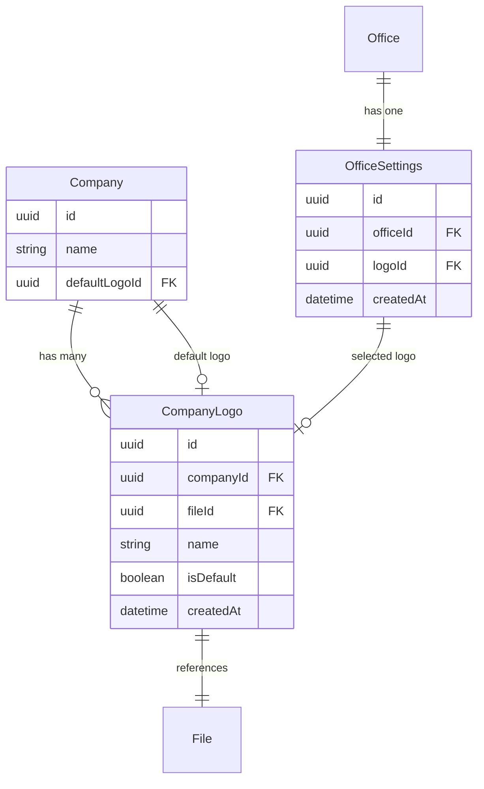
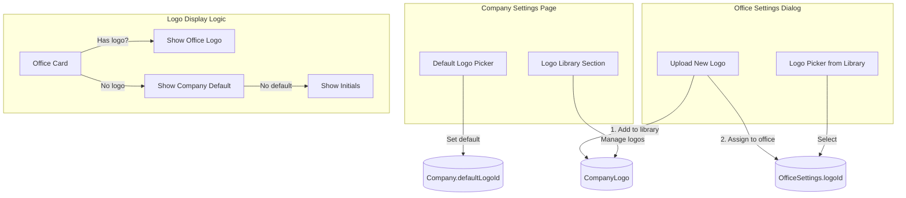

# Company Logo Library System

## Architecture Overview



## Data Flow



---

## Phase 1: Database Schema Changes

### 1.1 Create CompanyLogo Entity

Create new entity at `apps/api/src/entities/CompanyLogo.entity.ts`:

```typescript
@Entity()
export class CompanyLogo {
  @PrimaryKey({ type: 'uuid' })
  id: Opt<string> = uuid();

  @Property({ type: 'string' })
  name!: string; // User-friendly name like "Main Logo", "Holiday Logo"

  @ManyToOne('Company')
  @Index()
  company!: Company;

  @ManyToOne('File')
  file!: File;

  @Property({ type: 'Date' })
  createdAt: Opt<Date> = new Date();
}
```

### 1.2 Update Company Entity

Modify [apps/api/src/entities/Company.entity.ts](apps/api/src/entities/Company.entity.ts):

- Remove existing `logoFile` relationship (line 60-62)
- Add `defaultLogo` relationship to `CompanyLogo`
- Add `logos` collection for the library

```typescript
// Replace logoFile with:
@ManyToOne('CompanyLogo', { nullable: true })
defaultLogo?: CompanyLogo;

@OneToMany('CompanyLogo', 'company')
logos = new Collection<CompanyLogo>(this);
```

### 1.3 Update OfficeSettings Entity

Modify [apps/api/src/entities/OfficeSettings.entity.ts](apps/api/src/entities/OfficeSettings.entity.ts):

- Change `logoFile` to reference `CompanyLogo` instead of `File`

```typescript
// Replace logoFile with:
@ManyToOne('CompanyLogo', { nullable: true })
logo?: CompanyLogo;
```

### 1.4 Create Migration

Generate migration to:

- Create `company_logo` table
- Add `default_logo_id` to `company` table
- Migrate existing `logo_file_id` data to new structure
- Update `office_settings.logo_file_id` to `office_settings.logo_id`

---

## Phase 2: API Changes

### 2.1 Company Logo Library Endpoints

Create new routes at `apps/api/src/routes/company-logos.ts`:| Method | Endpoint | Purpose |

|--------|----------|---------|

| GET | `/companies/logos` | List company logo library |

| POST | `/companies/logos` | Upload new logo to library |

| PATCH | `/companies/logos/:id` | Update logo name |

| DELETE | `/companies/logos/:id` | Delete logo from library |

| POST | `/companies/logos/:id/set-default` | Set as company default |

### 2.2 Update Company Settings Endpoints

Modify [apps/api/src/routes/companies.ts](apps/api/src/routes/companies.ts):

- Update `GET /companies/settings` to include `defaultLogo` and `logoLibrary`
- Remove logo upload/remove from settings (moved to library)
- Add `PATCH /companies/settings/default-logo` to set default from library

### 2.3 Update Office Settings Endpoints

Modify [apps/api/src/routes/office-settings/settings.routes.ts](apps/api/src/routes/office-settings/settings.routes.ts):

- Change `POST /offices/:id/settings/logo` to accept `logoId` (from library) OR file upload
- Update logo removal to just unset the reference
- Add logic: if file uploaded, add to company library first, then assign

---

## Phase 3: Frontend - Company Settings

### 3.1 Update Company Settings Page

Modify [apps/web/src/pages/CompanySettingsPage.tsx](apps/web/src/pages/CompanySettingsPage.tsx):Replace current "Company Logo" card with expanded "Logo Library" section:

```javascript
+----------------------------------------------------------+
|  Logo Library                                              |
|  Manage logos for your company and offices                 |
+----------------------------------------------------------+
|                                                            |
|  Default Logo (inherited by offices without a logo)        |
|  +--------+  Company Main Logo  [Change Default]           |
|  | [LOGO] |  Used by: 3 offices                           |
|  +--------+                                                |
|                                                            |
|  Logo Library (4 logos)                 [+ Add Logo]       |
|  +--------+ +--------+ +--------+ +--------+              |
|  | Logo 1 | | Logo 2 | | Logo 3 | | Logo 4 |              |
|  | ★ Def  | |        | |        | |        |              |
|  +--------+ +--------+ +--------+ +--------+              |
|                                                            |
+----------------------------------------------------------+
```

### 3.2 New Components

Create in `apps/web/src/components/company/`:

- `LogoLibrarySection.tsx` - Main library management component
- `LogoCard.tsx` - Individual logo display with actions
- `LogoUploadDialog.tsx` - Dialog for uploading new logos
- `LogoPickerDialog.tsx` - Dialog for selecting a logo (reused by offices)

---

## Phase 4: Frontend - Office Settings

### 4.1 Update Office Settings Dialog

Modify [apps/web/src/components/offices/OfficeSettingsDialog.tsx](apps/web/src/components/offices/OfficeSettingsDialog.tsx):Replace current upload zone with logo picker:

```javascript
+------------------------------------------+
|  Office Settings - Platform HQ           |
+------------------------------------------+
|                                          |
|  Office Logo                             |
|                                          |
|  Current: [LOGO] Main Company Logo       |
|           (inherited from company)       |
|                                          |
|  [Choose from Library]  [Upload New]     |
|                                          |
|  [Reset to Default]                      |
|                                          |
+------------------------------------------+
```

### 4.2 Logo Picker Component

The `LogoPickerDialog` shows:

- Grid of available logos from company library
- Visual indicator for current selection
- Option to upload new (adds to library + assigns)

---

## Phase 5: Display Logic Updates

### 5.1 Update OfficeLogo Component

Modify [apps/web/src/components/offices/OfficeLogo.tsx](apps/web/src/components/offices/OfficeLogo.tsx):Add fallback logic:

1. Show office's selected logo if set
2. Fall back to company default logo
3. Fall back to initials

### 5.2 Update Office Card

Modify [apps/web/src/components/offices/OfficeCard.tsx](apps/web/src/components/offices/OfficeCard.tsx):

- Add visual indicator if using inherited logo (e.g., small badge)
- Update tooltip to show "Using company default" when applicable

---

## Implementation Order

1. **Database**: Create entity, migration, update existing entities
2. **API - Library**: New company logo library endpoints
3. **API - Settings**: Update company and office settings endpoints
4. **Frontend - Library**: Logo library UI in Company Settings
5. **Frontend - Picker**: Logo picker dialog (shared component)
6. **Frontend - Office**: Update office settings to use picker
7. **Frontend - Display**: Update logo display with inheritance logic
8. **Testing**: Integration tests for new endpoints and flows

---

## Migration Strategy

For existing data:

- Company's current `logoFile` becomes first entry in logo library AND set as default
- Office's current `logoFile` is matched to new CompanyLogo entry
