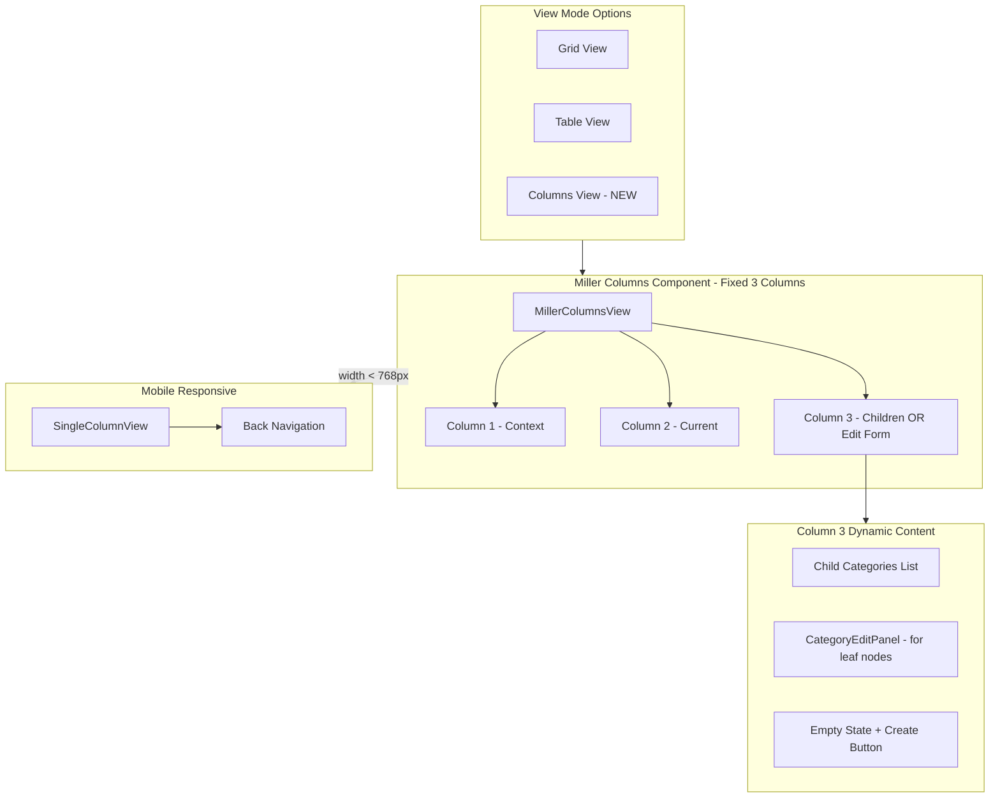

# Miller Columns View for Price Guide Categories

## Architecture Overview



## Key Design Decisions

### Fixed 3-Column Layout (No Horizontal Scroll)

Instead of unlimited columns with horizontal scrolling, we use a **fixed 3-column layout** where columns shift left as the user drills deeper:

| Column 1 | Column 2 | Column 3 |

|----------|----------|----------|

| Parent context | Current selection's siblings | Children of current selection |

**Navigation behavior:**

- **Click in Column 1** → "Go back" - resets columns 2 & 3 to show that item's context
- **Click in Column 2** → Update column 3 to show children of clicked item
- **Click in Column 3 (has children)** → "Go deeper" - all columns shift left
- **Click in Column 3 (leaf node)** → Show edit form in column 3

### Inline Edit Form for Leaf Nodes

When selecting a category with no children, column 3 displays an **inline edit form** instead of an empty list. This:

- Reduces clicks (no modal needed)
- Maintains navigation context (user sees path to item)
- Provides immediate editing capability

## Key Files to Modify/Create

**Modify:**

- [`apps/web/src/components/price-guide/ViewToggle.tsx`](apps/web/src/components/price-guide/ViewToggle.tsx) - Add "columns" to ViewMode type and toggle
- [`apps/web/src/pages/PriceGuideCategoriesPage.tsx`](apps/web/src/pages/PriceGuideCategoriesPage.tsx) - Add ColumnView rendering, hide sidebar when in columns mode

**Create:**

- `apps/web/src/components/price-guide/MillerColumnsView.tsx` - Main container managing column state and shift logic
- `apps/web/src/components/price-guide/MillerColumn.tsx` - Individual column component
- `apps/web/src/components/price-guide/CategoryEditPanel.tsx` - Inline edit form for leaf nodes
- `apps/web/src/components/price-guide/CategoryContextMenu.tsx` - Right-click context menu
- `apps/web/src/hooks/useContextMenu.ts` - Hook for context menu positioning

## Implementation Details

### 1. ViewMode Update

Update `ViewToggle.tsx`:

```typescript
export type ViewMode = 'grid' | 'table' | 'columns';
```

Add `ViewColumnIcon` (or `ViewWeekIcon`) from MUI icons and third toggle button.

### 2. MillerColumnsView Component

**State management:**

```typescript
type ColumnState = {
  // Path of selected category IDs from root to current
  selectedPath: string[];
  // Currently selected category in each visible column (for highlighting)
  columnSelections: [string | null, string | null, string | null];
};
```

**Column shift logic:**

```typescript
// Determine what each column shows based on selectedPath depth
function getVisibleColumns(selectedPath: string[]): VisibleColumns {
  const depth = selectedPath.length;

  if (depth === 0) {
    // At root: Col1=root, Col2=empty, Col3=empty
    return { col1ParentId: null, col2ParentId: null, col3ParentId: null };
  }
  if (depth === 1) {
    // One level deep: Col1=root, Col2=selected's children, Col3=empty
    return {
      col1ParentId: null,
      col2ParentId: selectedPath[0],
      col3ParentId: null,
    };
  }
  if (depth === 2) {
    // Two levels: Col1=root, Col2=parent's siblings, Col3=selected's children
    return {
      col1ParentId: null,
      col2ParentId: selectedPath[0],
      col3ParentId: selectedPath[1],
    };
  }
  // Deeper: shift window - show last 3 levels
  return {
    col1ParentId: selectedPath[depth - 3],
    col2ParentId: selectedPath[depth - 2],
    col3ParentId: selectedPath[depth - 1],
  };
}
```

**Key behaviors:**

- Each column independently fetches its children via `usePriceGuideCategoriesList({ parentId })`
- Clicking a different item in column 1 or 2 clears/updates columns to the right
- Smooth transition animations when columns shift

### 3. MillerColumn Component

Individual column displaying a list of categories:

```typescript
type MillerColumnProps = {
  parentId: string | null;
  selectedId: string | null;
  onSelect: (category: PriceGuideCategoryListItem) => void;
  onContextMenu: (
    e: React.MouseEvent,
    category: PriceGuideCategoryListItem,
  ) => void;
  emptyMessage?: string;
  showCreateButton?: boolean;
};
```

**Visual indicators:**

- **Chevron `>`** on items that have children (navigate deeper)
- **No chevron** on leaf nodes (will show edit form)
- **Highlighted background** for selected item
- **Muted/dimmed** styling for column 1 (context column)
- **Child count badge** optional: `Shingles (12) >`

### 4. CategoryEditPanel Component

Inline edit form displayed in column 3 when a leaf node is selected:

```typescript
type CategoryEditPanelProps = {
  category: PriceGuideCategoryListItem;
  onSave: (data: { name: string; isActive: boolean }) => Promise<void>;
  onDelete: () => void;
  onMove: () => void;
  isSaving: boolean;
  canUpdate: boolean;
  canDelete: boolean;
};
```

**Form contents:**

- Category name text field
- Active/Inactive toggle switch
- Save button (primary)
- Move button (opens move dialog)
- Delete button (opens confirmation)

**Styling:** Should feel integrated with column layout, not like a foreign modal.

### 5. Context Menu for Parent Categories

Since leaf nodes show inline edit, parent categories need context menu for actions:

```typescript
// CategoryContextMenu.tsx
type ContextMenuProps = {
  anchorPosition: { x: number; y: number } | null;
  category: PriceGuideCategoryListItem | null;
  onClose: () => void;
  onEdit: () => void; // Opens edit dialog for parent categories
  onMove: () => void;
  onDelete: () => void;
  canUpdate: boolean;
  canDelete: boolean;
};
```

**Trigger:** Right-click on any category item, or click on kebab menu icon (⋮) on hover.

### 6. Responsive Single-Column Mode

Use `useMediaQuery` to detect `(max-width: 768px)`:

- Show only one column at a time (current level)
- Header shows: `< Back` button + current category name
- Selecting an item with children → navigate forward (show children)
- Selecting a leaf item → show edit form (full width)
- Back button → return to parent level

### 7. Page Layout Changes

When `viewMode === 'columns'`:

- Hide the tree sidebar entirely (columns replace its function)
- Hide breadcrumb (path is visible in columns)
- Full-width 3-column container

When `viewMode === 'grid' | 'table'`:

- Keep current layout with sidebar

**State synchronization:** When switching view modes, preserve `currentCategoryId` in URL so user stays at same location.

## Visual Design Reference

**Desktop - Navigating hierarchy:**

```
┌──────────────────┬──────────────────┬──────────────────┐
│ Root Categories  │ Roofing          │ Shingles         │
├──────────────────┼──────────────────┼──────────────────┤
│                  │                  │                  │
│ Roofing        > │ Shingles       > │ 3-Tab          > │
│ Windows          │ Flashing         │ Architectural  > │
│ Bathrooms        │ Gutters          │ Metal          > │
│ Kitchens         │ Underlayment     │ Tile             │
│                  │                  │                  │
│ (dim styling)    │ (active)         │ (active)         │
└──────────────────┴──────────────────┴──────────────────┘
       ↑ Context         ↑ Current          ↑ Children
```

**Desktop - Editing a leaf node:**

```
┌──────────────────┬──────────────────┬──────────────────┐
│ Roofing          │ Shingles         │ ╔══════════════╗ │
├──────────────────┼──────────────────┤ ║ Edit: Tile   ║ │
│                  │                  │ ╠══════════════╣ │
│ Shingles       > │ 3-Tab            │ ║ Name:        ║ │
│ Flashing         │ Architectural    │ ║ [Tile      ] ║ │
│ Gutters          │ Metal          > │ ║              ║ │
│ Underlayment     │ Tile         [●] │ ║ ☑ Active     ║ │
│                  │                  │ ║              ║ │
│                  │                  │ ║ [Save] [Del] ║ │
│                  │                  │ ╚══════════════╝ │
└──────────────────┴──────────────────┴──────────────────┘
                         ↑ Selected         ↑ Edit Form
                         (highlighted)
```

**Desktop - Empty category:**

```
┌──────────────────┬──────────────────┬──────────────────┐
│ Root Categories  │ Roofing          │                  │
├──────────────────┼──────────────────┤   No subcate-    │
│                  │                  │   gories yet     │
│ Roofing        > │ Shingles       > │                  │
│ Windows          │ Flashing     [●] │  [+ Create]      │
│ Bathrooms        │                  │                  │
└──────────────────┴──────────────────┴──────────────────┘
                         ↑ Selected         ↑ Empty state
                         (has no children)
```

**Mobile (single column with back nav):**

```
┌────────────────────────┐
│ < Shingles             │
├────────────────────────┤
│ 3-Tab                > │
│ Architectural        > │
│ Metal                > │
│ Tile                   │
└────────────────────────┘
```

## Empty State Handling

| Scenario | Column 3 Display |

|----------|------------------|

| Selected category has children | List of child categories |

| Selected category is leaf node | CategoryEditPanel form |

| Selected category has no children but user can create | Empty state + "Create subcategory" button |

| No selection yet | Placeholder: "Select a category" |

## Accessibility Requirements

- **ARIA roles:** `role="tree"` on container, `role="treeitem"` on items
- **Keyboard navigation:**
  - Arrow Up/Down: move selection within column
  - Arrow Right: drill into selected (if has children)
  - Arrow Left: go back to parent column
  - Enter: select/activate item
  - Escape: close context menu
- **Focus management:** Focus moves to column 3 when drilling down
- **Screen reader announcements:** "Entering [category name], [n] items"

## API Requirements

No backend changes needed - existing endpoints support this:

- `GET /price-guide-categories/list?parentId={id}` - Returns children for a category
- `GET /price-guide-categories/tree` - Can be used for preloading if needed
- `PATCH /price-guide-categories/:id` - Update category (used by edit panel)
- `DELETE /price-guide-categories/:id` - Delete category

## Testing Considerations

- Test column navigation at various depths (1, 2, 3, 5+ levels)
- Test column shift behavior when drilling deeper than 3 levels
- Test leaf node detection and edit form display
- Test responsive breakpoint transition to single-column
- Test context menu positioning near screen edges
- Test keyboard navigation (arrow keys, Enter, Escape)
- Test view preference persistence across sessions
- Test state sync when switching between grid/table/columns views
- Test empty states (no children, no selection)
- Test permissions (canUpdate/canDelete affecting UI)
