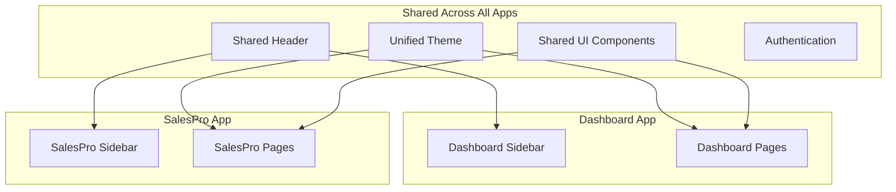

# Multi-App Architecture Implementation

## Overview

This plan adds support for multiple applications within the same codebase, starting with:

- **Silk Road Dashboard** - Admin/management app (current functionality)
- **Silk Road SalesPro** - Field sales rep app (new, scaffolding only)

Future apps can be added using the same pattern.

## What's Shared vs. What's Different

```javascript
┌─────────────────────────────────────────────────────────────────┐
│                    SHARED HEADER (AppShell)                     │
│  ┌─────────┐                           ┌─────────┐ ┌─────────┐  │
│  │  Logo   │         (spacer)          │App Grid │ │User Info│  │
│  └─────────┘                           └─────────┘ └─────────┘  │
├─────────────────┬───────────────────────────────────────────────┤
│                 │                                               │
│   APP-SPECIFIC  │              APP-SPECIFIC                     │
│     SIDEBAR     │                 PAGES                         │
│                 │                                               │
│   Dashboard:    │   Dashboard:                                  │
│   • Users       │   • UsersPage                                 │
│   • Roles       │   • RolesPage                                 │
│   • Offices     │   • OfficesPage                               │
│   • Price Guide │   • PriceGuidePage                            │
│   • Settings    │   • SettingsPage                              │
│                 │                                               │
│   SalesPro:     │   SalesPro:                                   │
│   • Projects    │   • ProjectsPage                              │
│   • Estimates   │   • EstimatesPage                             │
│   • Customers   │   • CustomersPage                             │
│   • etc.        │   • etc.                                      │
│                 │                                               │
└─────────────────┴───────────────────────────────────────────────┘
```

### SHARED (Same across all apps)

- **Header bar** - App switcher, user info, company name, logout button
- **Theme** - Colors, typography, spacing, shadows
- **UI Components** - Buttons, forms, tables, modals, etc.
- **Authentication** - Login, session management, permissions
- **API Client** - How we communicate with the backend

### DIFFERENT (Unique per app)

- **Sidebar navigation** - Each app has its own menu items
- **Pages/Views** - Completely different screens and functionality
- **App-specific hooks** - Business logic specific to each app
- **App-specific components** - UI components only used in one app

## Architecture



## Folder Structure

Each app has its own folder with complete separation. Shared code lives in `shared/`.

```javascript
apps/web/src/
├── apps/                              # App-specific code (DIFFERENT per app)
│   ├── dashboard/                     # Dashboard app (admin/management)
│   │   ├── components/                # Dashboard-only components
│   │   ├── pages/                     # Dashboard pages (Users, Roles, etc.)
│   │   │   ├── DashboardPage.tsx
│   │   │   ├── UsersPage.tsx
│   │   │   ├── RolesPage.tsx
│   │   │   ├── OfficesPage.tsx
│   │   │   ├── price-guide/
│   │   │   └── index.ts
│   │   ├── hooks/                     # Dashboard-only hooks
│   │   ├── DashboardSidebar.tsx       # Dashboard navigation menu
│   │   ├── DashboardLayout.tsx        # Uses AppShell + DashboardSidebar
│   │   └── index.ts
│   │
│   └── salespro/                      # SalesPro app (field sales)
│       ├── components/                # SalesPro-only components
│       ├── pages/                     # SalesPro pages (Projects, Estimates, etc.)
│       │   ├── SalesProHomePage.tsx
│       │   └── index.ts
│       ├── hooks/                     # SalesPro-only hooks
│       ├── SalesProSidebar.tsx        # SalesPro navigation menu
│       ├── SalesProLayout.tsx         # Uses AppShell + SalesProSidebar
│       └── index.ts
│
├── shared/                            # SHARED across ALL apps
│   ├── components/                    # Shared UI components
│   │   ├── AppSwitcher.tsx            # Google-style app grid
│   │   ├── AppGuard.tsx               # App permission guard
│   │   ├── PermissionGuard.tsx
│   │   ├── ProtectedRoute.tsx
│   │   └── ...
│   ├── hooks/                         # Shared hooks
│   │   ├── useAuth.ts
│   │   ├── useApps.ts
│   │   ├── usePermissions.ts
│   │   └── ...
│   ├── layouts/                       # Shared layout components
│   │   └── AppShell.tsx               # Header wrapper (SAME for all apps)
│   ├── context/                       # Shared contexts
│   │   ├── AuthContext.tsx
│   │   ├── AppContext.tsx
│   │   └── ...
│   └── lib/                           # Shared utilities
│
├── theme/                             # Unified theme (SAME for all apps)
├── router.tsx                         # Routes to both apps
├── App.tsx
└── main.tsx
```

## Implementation Plan

### Phase 1: Shared Types and App Registry

**File: `packages/shared/src/types/apps.ts`** (new)Define app types and registry:

```typescript
/** Available applications in the platform */
export type AppId = 'dashboard' | 'salespro';

export type AppDefinition = {
  id: AppId;
  name: string;
  description: string;
  icon: string;
  basePath: string;
  permission: string;
};

export const APP_REGISTRY: Record<AppId, AppDefinition> = {
  dashboard: {
    id: 'dashboard',
    name: 'Silk Road Dashboard',
    description: 'Admin & management console',
    icon: 'dashboard',
    basePath: '/dashboard',
    permission: 'app:dashboard',
  },
  salespro: {
    id: 'salespro',
    name: 'Silk Road SalesPro',
    description: 'Field sales application',
    icon: 'storefront',
    basePath: '/sales',
    permission: 'app:salespro',
  },
};
```

Export from `packages/shared/src/types/index.ts`.---

### Phase 2: Backend Permission Updates

**File: `apps/api/src/lib/permissions.ts`**Add app-level permissions:

```typescript
// App Access Permissions
APP_DASHBOARD: 'app:dashboard',
APP_SALESPRO: 'app:salespro',
```

Add metadata:

```typescript
'app:dashboard': {
  label: 'Dashboard Access',
  category: 'Applications',
  description: 'Access the Silk Road Dashboard (admin console)',
},
'app:salespro': {
  label: 'SalesPro Access',
  category: 'Applications',
  description: 'Access the Silk Road SalesPro (field sales app)',
},
```

**File: `apps/api/scripts/seed-roles.ts`**Update default roles with app permissions:

- `superUser` and `admin`: Both apps
- `salesRep`: SalesPro only
- Platform roles: Both apps (for support access)

---

### Phase 3: Create Folder Structure

Create the new folder structure:

```bash
mkdir -p apps/web/src/apps/dashboard/{components,pages,hooks}
mkdir -p apps/web/src/apps/salespro/{components,pages,hooks}
mkdir -p apps/web/src/shared/{components,hooks,layouts,context,lib}
```

---

### Phase 4: Shared AppShell Component

**File: `apps/web/src/shared/layouts/AppShell.tsx`** (new)The AppShell provides the **consistent header** that appears on ALL apps:

```typescript
type AppShellProps = {
  sidebar: React.ReactNode;  // App provides its own sidebar
  children: React.ReactNode; // App provides its own pages
};

export function AppShell({ sidebar, children }: AppShellProps) {
  return (
    <Box sx={{ display: 'flex', minHeight: '100vh' }}>
      {/* Sidebar - provided by each app (DIFFERENT) */}
      <Drawer>{sidebar}</Drawer>

      {/* Main content area */}
      <Box component="main">
        {/* SHARED HEADER - identical across all apps */}
        <AppBar>
          <Toolbar>
            <MobileMenuButton />
            <Box sx={{ flexGrow: 1 }} />
            <AppSwitcher />  {/* App switcher grid */}
            <UserMenu />     {/* User info, company, logout */}
          </Toolbar>
        </AppBar>

        {/* Page content - provided by each app (DIFFERENT) */}
        {children}
      </Box>
    </Box>
  );
}
```

---

### Phase 5: App Switcher Component

**File: `apps/web/src/shared/components/AppSwitcher.tsx`** (new)Google-style 9-dot grid app switcher:

```typescript
// Key features:
// - AppsIcon (MUI) as trigger button
// - Popover with grid of available apps
// - Each app tile: icon, name, description
// - Filtered by user's app permissions
// - Click navigates to app's basePath
```

**File: `apps/web/src/shared/hooks/useApps.ts`** (new)Hook to get user's accessible apps:

```typescript
export function useApps() {
  const { permissions } = useUserPermissions();

  const accessibleApps = useMemo(
    () =>
      Object.values(APP_REGISTRY).filter(app =>
        hasPermission(app.permission, permissions),
      ),
    [permissions],
  );

  return { apps: accessibleApps, hasMultipleApps: accessibleApps.length > 1 };
}
```

---

### Phase 6: App-Specific Layouts

**File: `apps/web/src/apps/dashboard/DashboardLayout.tsx`** (new)

```typescript
export function DashboardLayout() {
  return (
    <AppShell sidebar={<DashboardSidebar />}>
      <Outlet />  {/* Dashboard pages render here */}
    </AppShell>
  );
}
```

**File: `apps/web/src/apps/salespro/SalesProLayout.tsx`** (new)

```typescript
export function SalesProLayout() {
  return (
    <AppShell sidebar={<SalesProSidebar />}>
      <Outlet />  {/* SalesPro pages render here */}
    </AppShell>
  );
}
```

---

### Phase 7: App-Specific Sidebars

**File: `apps/web/src/apps/dashboard/DashboardSidebar.tsx`**Extract from current Sidebar.tsx - contains Dashboard navigation:

- Dashboard, Users, Roles, Offices, Price Guide, Settings, etc.

**File: `apps/web/src/apps/salespro/SalesProSidebar.tsx`** (new)Placeholder sidebar for SalesPro:

- Home, Projects, Estimates, Customers (placeholder items)

---

### Phase 8: Route Structure Updates

**File: `apps/web/src/router.tsx`**

```typescript
import { DashboardLayout } from './apps/dashboard/DashboardLayout';
import { SalesProLayout } from './apps/salespro/SalesProLayout';
import { AppGuard } from './shared/components/AppGuard';

// Dashboard routes (under /dashboard/*)
{
  path: '/dashboard',
  element: (
    <AppGuard app="dashboard">
      <DashboardLayout />
    </AppGuard>
  ),
  children: [
    { index: true, element: <DashboardPage /> },
    { path: 'users', element: <UsersPage /> },
    { path: 'roles', element: <RolesPage /> },
    // ... other dashboard routes
  ],
},

// SalesPro routes (under /sales/*)
{
  path: '/sales',
  element: (
    <AppGuard app="salespro">
      <SalesProLayout />
    </AppGuard>
  ),
  children: [
    { index: true, element: <SalesProHomePage /> },
    // Future sales routes...
  ],
},
```

---

### Phase 9: Migration

Move existing files to new structure:| From | To |

|------|-----|

| `src/pages/*` | `src/apps/dashboard/pages/*` |

| `src/components/Sidebar.tsx` | `src/apps/dashboard/DashboardSidebar.tsx` |

| `src/hooks/*` | `src/shared/hooks/*` |

| `src/context/*` | `src/shared/context/*` |

| `src/layouts/AppLayout.tsx` | Deleted (replaced by DashboardLayout) |

| `src/lib/*` | `src/shared/lib/*` |---

## File Summary

### New Files

| File | Description |

|------|-------------|

| `packages/shared/src/types/apps.ts` | App types and registry |

| `apps/web/src/shared/layouts/AppShell.tsx` | Shared header wrapper |

| `apps/web/src/shared/components/AppSwitcher.tsx` | Google-style app switcher |

| `apps/web/src/shared/components/AppGuard.tsx` | App permission guard |

| `apps/web/src/shared/hooks/useApps.ts` | Hook for accessible apps |

| `apps/web/src/shared/context/AppContext.tsx` | Current app context |

| `apps/web/src/apps/dashboard/DashboardLayout.tsx` | Dashboard layout |

| `apps/web/src/apps/dashboard/DashboardSidebar.tsx` | Dashboard navigation |

| `apps/web/src/apps/salespro/SalesProLayout.tsx` | SalesPro layout |

| `apps/web/src/apps/salespro/SalesProSidebar.tsx` | SalesPro navigation |

| `apps/web/src/apps/salespro/pages/SalesProHomePage.tsx` | Placeholder page |

### Modified Files

| File | Action |

|------|--------|

| `packages/shared/src/types/index.ts` | Export apps types |

| `apps/api/src/lib/permissions.ts` | Add app:dashboard, app:salespro permissions |

| `apps/api/scripts/seed-roles.ts` | Add app permissions to default roles |

| `apps/web/src/router.tsx` | App-aware routing with new structure |---

## Future Considerations

1. **Adding New Apps**: Create folder in `apps/<newapp>/` with Layout, Sidebar, and pages
2. **Unified Theme**: Same theme across all apps - no app-specific themes
3. **Shared Components**: All components in `shared/` work identically across apps
4. **Per-App Content**: Each app has its own sidebar AND pages (completely different functionality)
