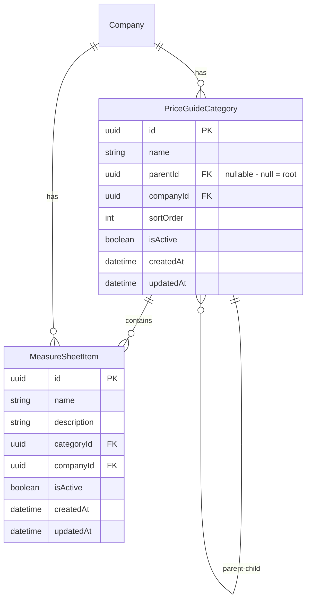

# Price Guide Categories Implementation

## Overview

Build a hierarchical category system for the price guide where categories can be nested infinitely deep (like folders). Measure sheet items will belong to leaf categories.

## Data Model

