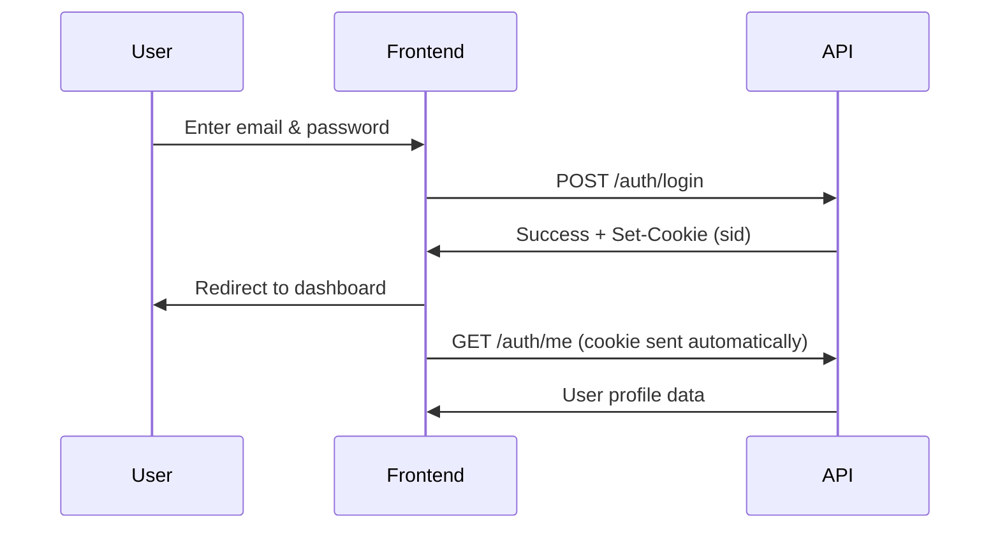
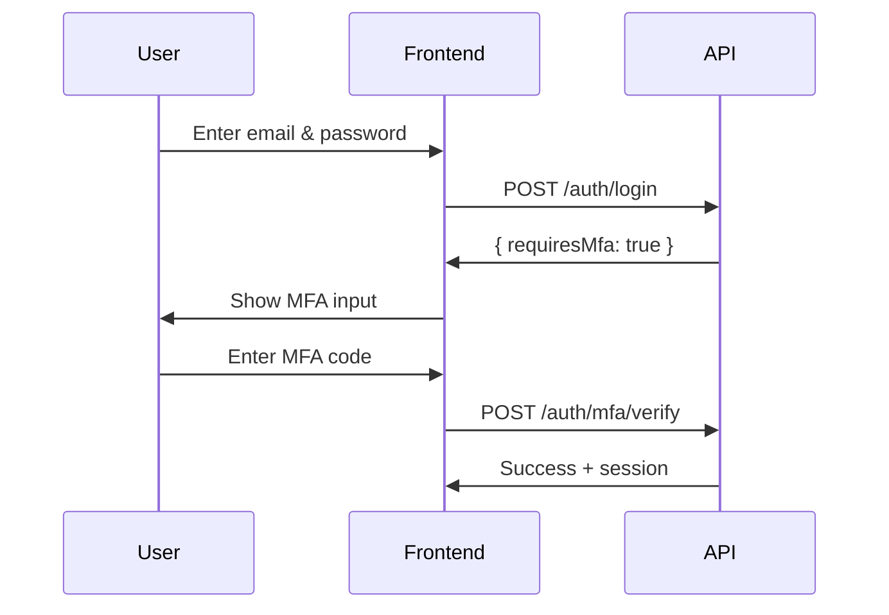

# Frontend Authentication API Documentation

This document provides the API specification for implementing a login page and authentication flow in your frontend application.

## Table of Contents

- [Overview](#overview)
- [Base Configuration](#base-configuration)
- [Authentication Flow](#authentication-flow)
- [API Endpoints](#api-endpoints)
  - [Login](#login)
  - [Get Current User](#get-current-user)
  - [Logout](#logout)
  - [Forgot Password](#forgot-password)
  - [Reset Password](#reset-password)
- [Error Handling](#error-handling)
- [Session Management](#session-management)
- [Code Examples](#code-examples)

---

## Overview

The API uses **session-based authentication** with HTTP-only cookies. When a user successfully logs in, the server creates a session and sets a `sid` cookie automatically. This cookie is sent with all subsequent requests to authenticate the user.

**Key Points:**

- No need to manually store tokens - cookies are handled automatically by the browser
- Always include `credentials: 'include'` in fetch requests to send cookies
- Sessions expire after 7 days of inactivity (or 30 days with "Remember Me")

---

## Base Configuration

### API Base URL

```
Development: http://localhost:3001/api
Production:  https://api.yourdomain.com/api
```

### Required Headers

```typescript
const headers = {
  'Content-Type': 'application/json',
};
```

### Fetch Configuration

All API requests **must** include credentials to handle session cookies:

```typescript
const response = await fetch(`${API_BASE_URL}/auth/login`, {
  method: 'POST',
  headers: {
    'Content-Type': 'application/json',
  },
  credentials: 'include', // IMPORTANT: Required for cookies
  body: JSON.stringify(data),
});
```

---

## Authentication Flow

### Standard Login Flow



### MFA Flow (if enabled)



---

## API Endpoints

### Login

Authenticate a user and create a session.

**Endpoint:** `POST /auth/login`

**Request Body:**

| Field        | Type    | Required | Description                                                                |
| ------------ | ------- | -------- | -------------------------------------------------------------------------- |
| `email`      | string  | Yes      | User's email address                                                       |
| `password`   | string  | Yes      | User's password                                                            |
| `source`     | string  | No       | Client platform: `"web"`, `"ios"`, `"android"`, `"api"` (default: `"web"`) |
| `rememberMe` | boolean | No       | Extend session to 30 days (default: `false`)                               |

**Request Example:**

```json
{
  "email": "user@example.com",
  "password": "securePassword123",
  "source": "web",
  "rememberMe": true
}
```

**Success Response (200 OK):**

```json
{
  "message": "Login successful",
  "user": {
    "id": "abc123-def456-...",
    "email": "user@example.com",
    "nameFirst": "John",
    "nameLast": "Doe"
  }
}
```

**MFA Required Response (200 OK):**

When the user has MFA enabled, the API returns:

```json
{
  "requiresMfa": true,
  "message": "MFA verification required"
}
```

**Error Responses:**

| Status | Response                                                                         | Description              |
| ------ | -------------------------------------------------------------------------------- | ------------------------ |
| 400    | `{ "error": "Validation error", "details": {...} }`                              | Invalid request body     |
| 401    | `{ "error": "Invalid credentials", "errorCode": "invalid_credentials" }`         | Wrong email or password  |
| 401    | `{ "error": "Account is deactivated", "errorCode": "account_inactive" }`         | Account disabled         |
| 401    | `{ "error": "Password reset required", "errorCode": "password_expired" }`        | Password expired         |
| 423    | `{ "error": "Account is temporarily locked...", "errorCode": "account_locked" }` | Too many failed attempts |
| 500    | `{ "error": "Internal server error" }`                                           | Server error             |

---

### Get Current User

Retrieve the currently authenticated user's profile.

**Endpoint:** `GET /auth/me`

**Request:** No body required (session cookie is sent automatically)

**Success Response (200 OK):**

```json
{
  "id": "abc123-def456-...",
  "email": "user@example.com",
  "nameFirst": "John",
  "nameLast": "Doe",
  "emailVerified": true,
  "mfaEnabled": false,
  "company": {
    "id": "company-123-...",
    "name": "Acme Corp"
  }
}
```

**Error Response (401 Unauthorized):**

```json
{
  "error": "Not authenticated"
}
```

---

### Logout

End the current session and clear the session cookie.

**Endpoint:** `POST /auth/logout`

**Request:** No body required

**Success Response (200 OK):**

```json
{
  "message": "Logged out successfully"
}
```

---

### Forgot Password

Request a password reset email.

**Endpoint:** `POST /auth/password/forgot`

**Request Body:**

```json
{
  "email": "user@example.com"
}
```

**Success Response (200 OK):**

```json
{
  "message": "If an account exists with this email, a reset link has been sent"
}
```

> **Note:** The response is always successful to prevent email enumeration attacks.

---

### Reset Password

Reset password using the token from the email link.

**Endpoint:** `POST /auth/password/reset`

**Request Body:**

| Field      | Type   | Required | Description                         |
| ---------- | ------ | -------- | ----------------------------------- |
| `token`    | string | Yes      | Reset token from email link         |
| `password` | string | Yes      | New password (minimum 8 characters) |

**Request Example:**

```json
{
  "token": "reset-token-from-email",
  "password": "newSecurePassword123"
}
```

**Success Response (200 OK):**

```json
{
  "message": "Password reset successful"
}
```

**Error Response (400 Bad Request):**

```json
{
  "error": "Invalid or expired token"
}
```

---

## Error Handling

### Error Codes

The API returns specific error codes for programmatic handling:

| Error Code            | Description                                       | Suggested Action                             |
| --------------------- | ------------------------------------------------- | -------------------------------------------- |
| `invalid_credentials` | Email or password is incorrect                    | Show generic "Invalid credentials" message   |
| `account_locked`      | Account temporarily locked due to failed attempts | Show lockout message, suggest password reset |
| `account_inactive`    | Account has been deactivated                      | Contact support                              |
| `password_expired`    | Password must be reset                            | Redirect to password reset                   |
| `mfa_required`        | MFA verification needed                           | Show MFA input screen                        |

### Validation Errors

When request validation fails (400 status), the `details` object contains field-specific errors:

```json
{
  "error": "Validation error",
  "details": {
    "fieldErrors": {
      "email": ["Invalid email"],
      "password": ["String must contain at least 1 character(s)"]
    },
    "formErrors": []
  }
}
```

---

## Session Management

### Session Durations

| Type         | Duration | Description                                     |
| ------------ | -------- | ----------------------------------------------- |
| Default      | 7 days   | Standard sliding expiration                     |
| Remember Me  | 30 days  | Extended session with "rememberMe: true"        |
| Absolute Max | 30 days  | Maximum session lifetime regardless of activity |

### Session Behavior

- **Sliding Expiration:** Session expiration resets on each authenticated request
- **Single Source:** Only one session per platform (web, ios, android, api) is allowed
- **Session Limits:** Users have a maximum number of concurrent sessions (configurable)

### Checking Authentication Status

On app initialization or route changes, verify the session:

```typescript
async function checkAuthStatus(): Promise<User | null> {
  try {
    const response = await fetch(`${API_BASE_URL}/auth/me`, {
      credentials: 'include',
    });

    if (response.ok) {
      return await response.json();
    }

    return null;
  } catch {
    return null;
  }
}
```

---

## Code Examples

### React Login Component

```tsx
import { useState } from 'react';

const API_BASE_URL = 'http://localhost:3001/api';

type LoginFormData = {
  email: string;
  password: string;
  rememberMe: boolean;
};

type LoginResponse = {
  message: string;
  user?: {
    id: string;
    email: string;
    nameFirst: string;
    nameLast: string;
  };
  requiresMfa?: boolean;
  error?: string;
  errorCode?: string;
};

export function LoginPage() {
  const [formData, setFormData] = useState<LoginFormData>({
    email: '',
    password: '',
    rememberMe: false,
  });
  const [error, setError] = useState<string | null>(null);
  const [isLoading, setIsLoading] = useState(false);

  const handleSubmit = async (e: React.FormEvent) => {
    e.preventDefault();
    setError(null);
    setIsLoading(true);

    try {
      const response = await fetch(`${API_BASE_URL}/auth/login`, {
        method: 'POST',
        headers: {
          'Content-Type': 'application/json',
        },
        credentials: 'include', // Required for cookies
        body: JSON.stringify({
          email: formData.email,
          password: formData.password,
          source: 'web',
          rememberMe: formData.rememberMe,
        }),
      });

      const data: LoginResponse = await response.json();

      if (!response.ok) {
        // Handle specific error codes
        if (data.errorCode === 'account_locked') {
          setError(
            'Your account is temporarily locked. Please try again later or reset your password.',
          );
        } else if (data.errorCode === 'password_expired') {
          setError('Your password has expired. Please reset it.');
          // Optionally redirect to password reset
        } else {
          setError(data.error || 'Login failed');
        }
        return;
      }

      // Check if MFA is required
      if (data.requiresMfa) {
        // Redirect to MFA verification page
        window.location.href = '/mfa-verify';
        return;
      }

      // Login successful - redirect to dashboard
      window.location.href = '/dashboard';
    } catch (err) {
      setError('Unable to connect to the server. Please try again.');
    } finally {
      setIsLoading(false);
    }
  };

  return (
    <form onSubmit={handleSubmit}>
      <h1>Sign In</h1>

      {error && <div className="error-message">{error}</div>}

      <div>
        <label htmlFor="email">Email</label>
        <input
          id="email"
          type="email"
          value={formData.email}
          onChange={e => setFormData({ ...formData, email: e.target.value })}
          required
        />
      </div>

      <div>
        <label htmlFor="password">Password</label>
        <input
          id="password"
          type="password"
          value={formData.password}
          onChange={e => setFormData({ ...formData, password: e.target.value })}
          required
        />
      </div>

      <div>
        <label>
          <input
            type="checkbox"
            checked={formData.rememberMe}
            onChange={e =>
              setFormData({ ...formData, rememberMe: e.target.checked })
            }
          />
          Remember me for 30 days
        </label>
      </div>

      <button type="submit" disabled={isLoading}>
        {isLoading ? 'Signing in...' : 'Sign In'}
      </button>

      <a href="/forgot-password">Forgot password?</a>
    </form>
  );
}
```

### API Service Module

```typescript
// services/api.ts

const API_BASE_URL =
  import.meta.env.VITE_API_URL || 'http://localhost:3001/api';

type FetchOptions = {
  method?: 'GET' | 'POST' | 'PUT' | 'DELETE';
  body?: unknown;
};

class ApiError extends Error {
  constructor(
    message: string,
    public status: number,
    public errorCode?: string,
  ) {
    super(message);
    this.name = 'ApiError';
  }
}

async function apiRequest<T>(
  endpoint: string,
  options: FetchOptions = {},
): Promise<T> {
  const { method = 'GET', body } = options;

  const response = await fetch(`${API_BASE_URL}${endpoint}`, {
    method,
    headers: {
      'Content-Type': 'application/json',
    },
    credentials: 'include',
    body: body ? JSON.stringify(body) : undefined,
  });

  const data = await response.json();

  if (!response.ok) {
    throw new ApiError(
      data.error || 'Request failed',
      response.status,
      data.errorCode,
    );
  }

  return data;
}

// Auth API methods
export const authApi = {
  login: (email: string, password: string, rememberMe = false) =>
    apiRequest<LoginResponse>('/auth/login', {
      method: 'POST',
      body: { email, password, source: 'web', rememberMe },
    }),

  logout: () =>
    apiRequest<{ message: string }>('/auth/logout', { method: 'POST' }),

  getCurrentUser: () => apiRequest<User>('/auth/me'),

  forgotPassword: (email: string) =>
    apiRequest<{ message: string }>('/auth/password/forgot', {
      method: 'POST',
      body: { email },
    }),

  resetPassword: (token: string, password: string) =>
    apiRequest<{ message: string }>('/auth/password/reset', {
      method: 'POST',
      body: { token, password },
    }),
};

// Types
type LoginResponse = {
  message: string;
  user?: User;
  requiresMfa?: boolean;
};

type User = {
  id: string;
  email: string;
  nameFirst: string;
  nameLast: string;
  emailVerified: boolean;
  mfaEnabled: boolean;
  company: {
    id: string;
    name: string;
  };
};
```

### Auth Context (React)

```tsx
// context/AuthContext.tsx

import {
  createContext,
  useContext,
  useEffect,
  useState,
  type ReactNode,
} from 'react';
import { authApi } from '../services/api';

type User = {
  id: string;
  email: string;
  nameFirst: string;
  nameLast: string;
  emailVerified: boolean;
  mfaEnabled: boolean;
  company: {
    id: string;
    name: string;
  };
};

type AuthContextType = {
  user: User | null;
  isLoading: boolean;
  isAuthenticated: boolean;
  login: (
    email: string,
    password: string,
    rememberMe?: boolean,
  ) => Promise<{ requiresMfa?: boolean }>;
  logout: () => Promise<void>;
  refreshUser: () => Promise<void>;
};

const AuthContext = createContext<AuthContextType | null>(null);

export function AuthProvider({ children }: { children: ReactNode }) {
  const [user, setUser] = useState<User | null>(null);
  const [isLoading, setIsLoading] = useState(true);

  // Check auth status on mount
  useEffect(() => {
    checkAuth();
  }, []);

  async function checkAuth() {
    try {
      const userData = await authApi.getCurrentUser();
      setUser(userData);
    } catch {
      setUser(null);
    } finally {
      setIsLoading(false);
    }
  }

  async function login(email: string, password: string, rememberMe = false) {
    const response = await authApi.login(email, password, rememberMe);

    if (response.requiresMfa) {
      return { requiresMfa: true };
    }

    if (response.user) {
      // Fetch full user data after login
      await checkAuth();
    }

    return {};
  }

  async function logout() {
    await authApi.logout();
    setUser(null);
  }

  async function refreshUser() {
    await checkAuth();
  }

  return (
    <AuthContext.Provider
      value={{
        user,
        isLoading,
        isAuthenticated: !!user,
        login,
        logout,
        refreshUser,
      }}
    >
      {children}
    </AuthContext.Provider>
  );
}

export function useAuth() {
  const context = useContext(AuthContext);
  if (!context) {
    throw new Error('useAuth must be used within an AuthProvider');
  }
  return context;
}
```

### Protected Route Component

```tsx
// components/ProtectedRoute.tsx

import { Navigate, useLocation } from 'react-router-dom';
import { useAuth } from '../context/AuthContext';

export function ProtectedRoute({ children }: { children: React.ReactNode }) {
  const { isAuthenticated, isLoading } = useAuth();
  const location = useLocation();

  if (isLoading) {
    return <div>Loading...</div>;
  }

  if (!isAuthenticated) {
    // Redirect to login, preserving the intended destination
    return <Navigate to="/login" state={{ from: location }} replace />;
  }

  return <>{children}</>;
}
```

---

## TypeScript Types Reference

```typescript
// types/auth.ts

/** Session source platforms */
type SessionSource = 'web' | 'ios' | 'android' | 'api';

/** Login request payload */
type LoginRequest = {
  email: string;
  password: string;
  source?: SessionSource;
  rememberMe?: boolean;
};

/** Login response */
type LoginResponse = {
  message: string;
  user?: {
    id: string;
    email: string;
    nameFirst: string;
    nameLast: string;
  };
  requiresMfa?: boolean;
  error?: string;
  errorCode?: LoginErrorCode;
};

/** Login error codes */
type LoginErrorCode =
  | 'invalid_credentials'
  | 'account_locked'
  | 'account_inactive'
  | 'email_not_verified'
  | 'password_expired'
  | 'mfa_required';

/** Current user response */
type CurrentUserResponse = {
  id: string;
  email: string;
  nameFirst: string;
  nameLast: string;
  emailVerified: boolean;
  mfaEnabled: boolean;
  company: {
    id: string;
    name: string;
  };
};

/** Validation error details */
type ValidationErrorDetails = {
  fieldErrors: Record<string, string[]>;
  formErrors: string[];
};

/** API error response */
type ApiErrorResponse = {
  error: string;
  errorCode?: string;
  details?: ValidationErrorDetails;
};
```

---

## CORS Configuration Note

If running the frontend on a different port/domain than the API, ensure the API's CORS configuration allows:

- Your frontend origin (e.g., `http://localhost:3000`)
- Credentials (`Access-Control-Allow-Credentials: true`)

---

## Quick Reference

| Action              | Method | Endpoint                | Auth Required |
| ------------------- | ------ | ----------------------- | ------------- |
| Login               | POST   | `/auth/login`           | No            |
| Logout              | POST   | `/auth/logout`          | No\*          |
| Get Current User    | GET    | `/auth/me`              | Yes           |
| Forgot Password     | POST   | `/auth/password/forgot` | No            |
| Reset Password      | POST   | `/auth/password/reset`  | No            |
| Get Sessions        | GET    | `/auth/sessions`        | Yes           |
| Revoke Session      | DELETE | `/auth/sessions/:sid`   | Yes           |
| Revoke All Sessions | DELETE | `/auth/sessions/all`    | Yes           |

\* Logout works whether authenticated or not, but only performs cleanup if authenticated.
