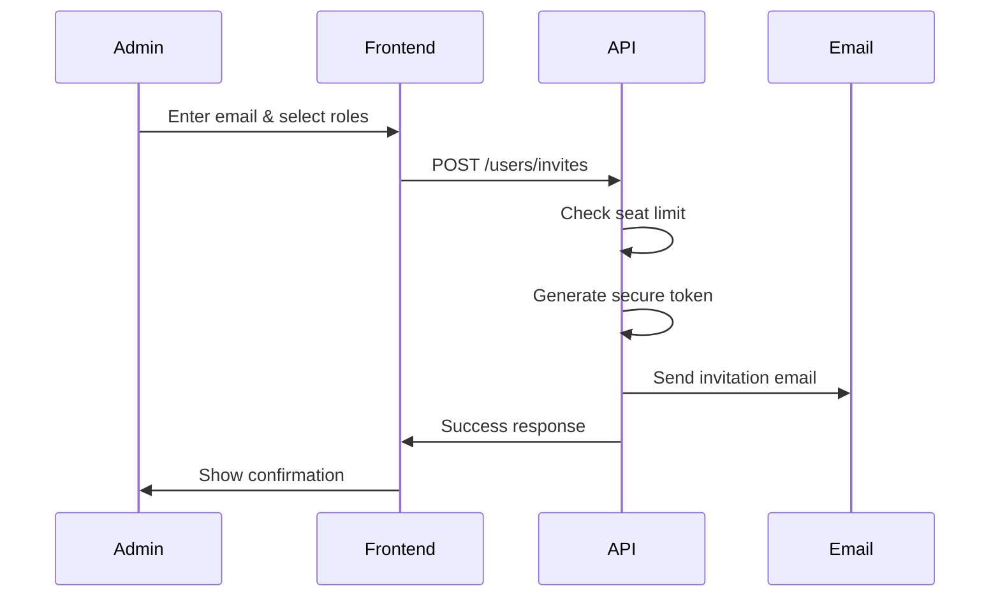
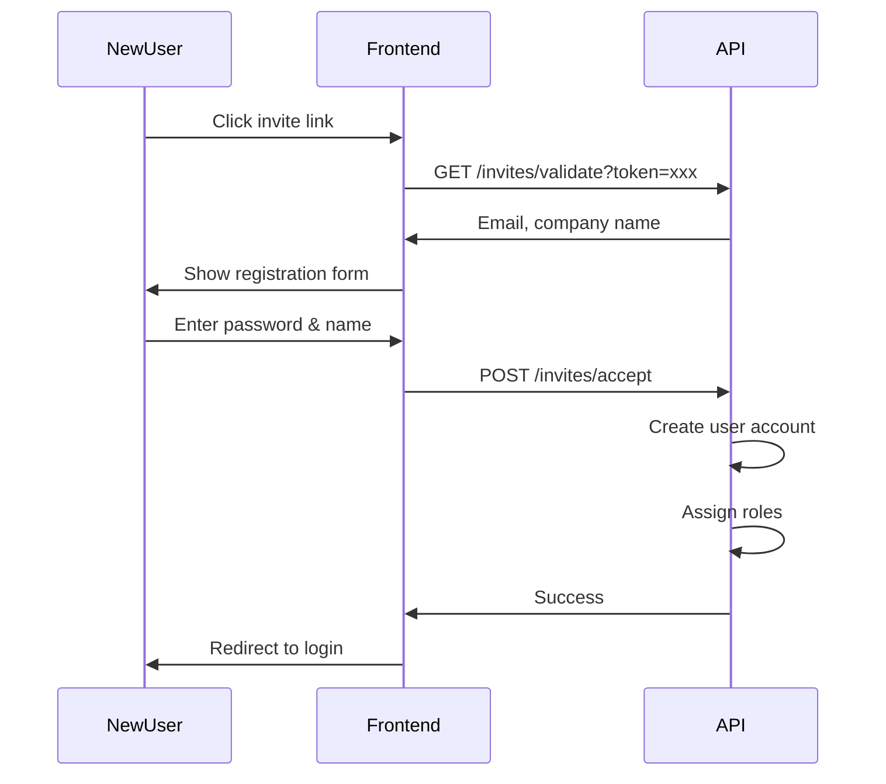

# User Invitations API Documentation

This document provides the API specification for implementing user invitation functionality in your frontend application.

## Table of Contents

- [Overview](#overview)
- [Invitation Flow](#invitation-flow)
- [API Endpoints](#api-endpoints)
  - [Send Invitation](#send-invitation)
  - [List Pending Invites](#list-pending-invites)
  - [Revoke Invitation](#revoke-invitation)
  - [Resend Invitation](#resend-invitation)
  - [Validate Token (Public)](#validate-token-public)
  - [Accept Invitation (Public)](#accept-invitation-public)
- [Error Handling](#error-handling)
- [TypeScript Types](#typescript-types)
- [Code Examples](#code-examples)

---

## Overview

The User Invitation system allows company administrators to invite new users to join their company via email. The flow works as follows:

1. An admin sends an invitation to an email address with selected roles
2. The invitee receives an email with a secure link
3. The invitee clicks the link and creates their account
4. The new user is automatically assigned the pre-selected roles

**Key Points:**

- Invitations expire after **7 days**
- Invitations are tied to a specific company
- Roles are pre-assigned during invitation and applied when accepted
- Company seat limits are enforced when creating invitations
- Users with `user:create` permission can send invitations

---

## Invitation Flow

### Send Invitation Flow



### Accept Invitation Flow



---

## API Endpoints

### Send Invitation

Send a new invitation to join the company.

**Endpoint:** `POST /users/invites`

**Authentication:** Required (session cookie)

**Permission Required:** `user:create`

**Request Body:**

| Field   | Type     | Required | Description                         |
| ------- | -------- | -------- | ----------------------------------- |
| `email` | string   | Yes      | Email address to invite             |
| `roles` | string[] | Yes      | Array of role IDs to assign on join |

**Request Example:**

```json
{
  "email": "newuser@example.com",
  "roles": ["role-uuid-1", "role-uuid-2"]
}
```

**Success Response (201 Created):**

```json
{
  "message": "Invitation sent successfully",
  "invite": {
    "id": "invite-uuid-123",
    "email": "newuser@example.com",
    "expiresAt": "2024-12-22T00:00:00.000Z"
  }
}
```

**Error Responses:**

| Status | Response                                                        | Description                     |
| ------ | --------------------------------------------------------------- | ------------------------------- |
| 400    | `{ "error": "A user with this email already exists" }`          | Email already registered        |
| 400    | `{ "error": "A pending invitation already exists..." }`         | Duplicate pending invite        |
| 400    | `{ "error": "Company has reached maximum seats (X)" }`          | Seat limit reached              |
| 400    | `{ "error": "Validation failed", "details": {...} }`            | Invalid request body            |
| 401    | `{ "error": "Not authenticated" }`                              | No session                      |
| 403    | `{ "error": "Forbidden" }`                                      | Missing `user:create` permission|

---

### List Pending Invites

Get all pending invitations for the company.

**Endpoint:** `GET /users/invites`

**Authentication:** Required (session cookie)

**Permission Required:** `user:read`

**Query Parameters:**

| Parameter | Type   | Default | Description              |
| --------- | ------ | ------- | ------------------------ |
| `page`    | number | 1       | Page number              |
| `limit`   | number | 20      | Items per page (max 100) |

**Success Response (200 OK):**

```json
{
  "invites": [
    {
      "id": "invite-uuid-123",
      "email": "newuser@example.com",
      "roles": ["role-uuid-1"],
      "expiresAt": "2024-12-22T00:00:00.000Z",
      "createdAt": "2024-12-15T00:00:00.000Z",
      "invitedBy": {
        "id": "user-uuid-456",
        "email": "admin@example.com",
        "nameFirst": "Admin",
        "nameLast": "User"
      }
    }
  ],
  "pagination": {
    "page": 1,
    "limit": 20,
    "total": 5,
    "totalPages": 1
  }
}
```

---

### Revoke Invitation

Cancel a pending invitation.

**Endpoint:** `DELETE /users/invites/:id`

**Authentication:** Required (session cookie)

**Permission Required:** `user:create`

**Success Response (200 OK):**

```json
{
  "message": "Invitation revoked successfully"
}
```

**Error Responses:**

| Status | Response                                             | Description                    |
| ------ | ---------------------------------------------------- | ------------------------------ |
| 404    | `{ "error": "Invite not found or already processed"}`| Invite doesn't exist or used   |
| 401    | `{ "error": "Not authenticated" }`                   | No session                     |
| 403    | `{ "error": "Forbidden" }`                           | Missing permission             |

---

### Resend Invitation

Resend an invitation email with a fresh token and extended expiration.

**Endpoint:** `POST /users/invites/:id/resend`

**Authentication:** Required (session cookie)

**Permission Required:** `user:create`

**Success Response (200 OK):**

```json
{
  "message": "Invitation resent successfully",
  "invite": {
    "id": "invite-uuid-123",
    "email": "newuser@example.com",
    "expiresAt": "2024-12-22T00:00:00.000Z"
  }
}
```

**Error Responses:**

| Status | Response                                       | Description              |
| ------ | ---------------------------------------------- | ------------------------ |
| 400    | `{ "error": "Can only resend pending invites"}`| Invite already used      |
| 404    | `{ "error": "Invite not found" }`              | Invite doesn't exist     |

---

### Validate Token (Public)

Validate an invitation token. This is a public endpoint used when the invitee clicks the link.

**Endpoint:** `GET /invites/validate`

**Authentication:** Not required

**Query Parameters:**

| Parameter | Type   | Required | Description       |
| --------- | ------ | -------- | ----------------- |
| `token`   | string | Yes      | Invitation token  |

**Success Response (200 OK):**

```json
{
  "valid": true,
  "email": "newuser@example.com",
  "companyName": "Acme Corp"
}
```

**Error Responses:**

| Status | Response                                              | Description              |
| ------ | ----------------------------------------------------- | ------------------------ |
| 400    | `{ "error": "Invalid invitation token" }`             | Token not found          |
| 400    | `{ "error": "This invitation has already been used" }`| Already accepted         |
| 400    | `{ "error": "This invitation has been revoked" }`     | Invitation cancelled     |
| 400    | `{ "error": "This invitation has expired" }`          | Past expiration date     |

---

### Accept Invitation (Public)

Accept an invitation and create a user account. This is a public endpoint.

**Endpoint:** `POST /invites/accept`

**Authentication:** Not required

**Request Body:**

| Field       | Type   | Required | Description                          |
| ----------- | ------ | -------- | ------------------------------------ |
| `token`     | string | Yes      | Invitation token from email link     |
| `password`  | string | Yes      | New password (min 8 characters)      |
| `nameFirst` | string | No       | User's first name                    |
| `nameLast`  | string | No       | User's last name                     |

**Request Example:**

```json
{
  "token": "secure-token-from-email",
  "password": "SecurePassword123!",
  "nameFirst": "John",
  "nameLast": "Doe"
}
```

**Success Response (201 Created):**

```json
{
  "message": "Account created successfully",
  "user": {
    "id": "user-uuid-789",
    "email": "newuser@example.com",
    "nameFirst": "John",
    "nameLast": "Doe"
  }
}
```

**Error Responses:**

| Status | Response                                              | Description             |
| ------ | ----------------------------------------------------- | ----------------------- |
| 400    | `{ "error": "Invalid invitation token" }`             | Token invalid/expired   |
| 400    | `{ "error": "A user with this email already exists" }`| Email taken             |
| 400    | `{ "error": "Validation failed", "details": {...} }`  | Invalid request body    |

---

## Error Handling

### Common Error Codes

| Error Code          | Description                              | Suggested Action                    |
| ------------------- | ---------------------------------------- | ----------------------------------- |
| `invalid_token`     | Token is invalid or not found            | Show invalid link message           |
| `token_expired`     | Invitation has expired                   | Contact admin for new invite        |
| `token_used`        | Invitation already accepted              | Redirect to login                   |
| `token_revoked`     | Invitation was cancelled                 | Contact admin for new invite        |
| `seat_limit`        | Company has no available seats           | Contact admin to upgrade plan       |
| `duplicate_email`   | User already exists                      | Redirect to login                   |
| `duplicate_invite`  | Pending invite exists for email          | Resend existing invite              |

---

## TypeScript Types

```typescript
// types/invites.ts

/** Pending invite in list view */
type InviteListItem = {
  id: string;
  email: string;
  roles: string[];
  expiresAt: string;
  createdAt: string;
  invitedBy: {
    id: string;
    email: string;
    nameFirst?: string;
    nameLast?: string;
  };
};

/** Invites list response */
type InvitesListResponse = {
  invites: InviteListItem[];
  pagination: {
    page: number;
    limit: number;
    total: number;
    totalPages: number;
  };
};

/** Create invite request */
type CreateInviteRequest = {
  email: string;
  roles: string[];
};

/** Create invite response */
type CreateInviteResponse = {
  message: string;
  invite: {
    id: string;
    email: string;
    expiresAt: string;
  };
};

/** Validate token response */
type ValidateInviteResponse = {
  valid: boolean;
  email: string;
  companyName: string;
};

/** Accept invite request */
type AcceptInviteRequest = {
  token: string;
  password: string;
  nameFirst?: string;
  nameLast?: string;
};

/** Accept invite response */
type AcceptInviteResponse = {
  message: string;
  user: {
    id: string;
    email: string;
    nameFirst?: string;
    nameLast?: string;
  };
};
```

---

## Code Examples

### React Invite User Modal

```tsx
import { useState } from 'react';

type InviteFormData = {
  email: string;
  roles: string[];
};

export function InviteUserModal({ onClose, onSuccess }: {
  onClose: () => void;
  onSuccess: () => void;
}) {
  const [formData, setFormData] = useState<InviteFormData>({
    email: '',
    roles: [],
  });
  const [error, setError] = useState<string | null>(null);
  const [isLoading, setIsLoading] = useState(false);

  const handleSubmit = async (e: React.FormEvent) => {
    e.preventDefault();
    setError(null);
    setIsLoading(true);

    try {
      const response = await fetch('/api/users/invites', {
        method: 'POST',
        headers: { 'Content-Type': 'application/json' },
        credentials: 'include',
        body: JSON.stringify(formData),
      });

      const data = await response.json();

      if (!response.ok) {
        setError(data.error || 'Failed to send invitation');
        return;
      }

      onSuccess();
      onClose();
    } catch {
      setError('Unable to send invitation. Please try again.');
    } finally {
      setIsLoading(false);
    }
  };

  return (
    <form onSubmit={handleSubmit}>
      <h2>Invite User</h2>
      {error && <div className="error">{error}</div>}

      <label>
        Email
        <input
          type="email"
          value={formData.email}
          onChange={e => setFormData({ ...formData, email: e.target.value })}
          required
        />
      </label>

      {/* Role selection UI here */}

      <button type="submit" disabled={isLoading}>
        {isLoading ? 'Sending...' : 'Send Invitation'}
      </button>
    </form>
  );
}
```

### Accept Invitation Page

```tsx
import { useEffect, useState } from 'react';
import { useSearchParams, useNavigate } from 'react-router-dom';

export function AcceptInvitePage() {
  const [searchParams] = useSearchParams();
  const navigate = useNavigate();
  const token = searchParams.get('token') || '';

  const [inviteData, setInviteData] = useState<{
    email: string;
    companyName: string;
  } | null>(null);
  const [error, setError] = useState<string | null>(null);
  const [isValidating, setIsValidating] = useState(true);

  // Validate token on mount
  useEffect(() => {
    async function validateToken() {
      try {
        const response = await fetch(
          `/api/invites/validate?token=${encodeURIComponent(token)}`
        );
        const data = await response.json();

        if (!response.ok) {
          setError(data.error || 'Invalid invitation');
          return;
        }

        setInviteData({ email: data.email, companyName: data.companyName });
      } catch {
        setError('Unable to validate invitation');
      } finally {
        setIsValidating(false);
      }
    }

    if (token) {
      validateToken();
    } else {
      setError('No invitation token provided');
      setIsValidating(false);
    }
  }, [token]);

  const handleAccept = async (password: string, nameFirst?: string, nameLast?: string) => {
    const response = await fetch('/api/invites/accept', {
      method: 'POST',
      headers: { 'Content-Type': 'application/json' },
      body: JSON.stringify({ token, password, nameFirst, nameLast }),
    });

    if (response.ok) {
      navigate('/login');
    }
  };

  if (isValidating) {
    return <div>Validating invitation...</div>;
  }

  if (error) {
    return <div className="error">{error}</div>;
  }

  return (
    <div>
      <h1>Join {inviteData?.companyName}</h1>
      <p>Creating account for: {inviteData?.email}</p>
      {/* Password form here */}
    </div>
  );
}
```

---

## Quick Reference

| Action            | Method | Endpoint                     | Auth Required |
| ----------------- | ------ | ---------------------------- | ------------- |
| Send Invite       | POST   | `/users/invites`             | Yes           |
| List Invites      | GET    | `/users/invites`             | Yes           |
| Revoke Invite     | DELETE | `/users/invites/:id`         | Yes           |
| Resend Invite     | POST   | `/users/invites/:id/resend`  | Yes           |
| Validate Token    | GET    | `/invites/validate?token=`   | No            |
| Accept Invitation | POST   | `/invites/accept`            | No            |

---

## Related Documentation

- [Frontend Authentication API](./FRONTEND_AUTH_API.md) - Login, logout, and session management
- [Roles Implementation](./ROLES_IMPLEMENTATION_SUMMARY.md) - Role and permission system
- [Architecture](./ARCHITECTURE.md) - System architecture overview
