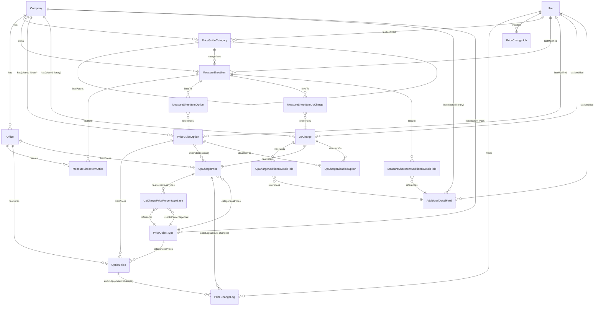

# Price Guide Rebuild - Data Model

[← Back to Index](./00-index.md)

---

## Entity Overview

**17 Total Entities**:

- 8 core entities (categories, items, shared libraries, pricing)
- 6 junction tables (many-to-many relationships)
- 3 operational entities (audit log, background jobs, percentage base)

---

## Entity Relationship Diagram



---

## Core Entities

### 1. PriceGuideCategory

Self-referential hierarchy for organizing MSIs.

| Field          | Type                             | Description                                   |
| -------------- | -------------------------------- | --------------------------------------------- |
| id             | uuid                             | Primary key                                   |
| company        | FK→Company                       | Multi-tenant isolation                        |
| parent         | FK→PriceGuideCategory (nullable) | Parent category (null=root)                   |
| name           | string                           | Category display name                         |
| sortOrder      | integer                          | Display order within parent                   |
| depth          | integer                          | Hierarchy depth (0=root, 1=sub, 2=drill-down) |
| isActive       | boolean                          | Soft delete                                   |
| version        | integer                          | Optimistic locking version                    |
| lastModifiedBy | FK→User (nullable)               | Who last modified this                        |
| createdAt      | timestamp                        |                                               |
| updatedAt      | timestamp                        | Auto-updated on changes                       |

**Indexes**:

- (company, parent)
- (company, name)

**Validation**:

- No hard depth limit enforced
- UI shows warning when depth > 5 levels

---

### 2. MeasureSheetItem

The main line item entity that sales reps add to estimates.

| Field            | Type                  | Description                                 |
| ---------------- | --------------------- | ------------------------------------------- |
| id               | uuid                  | Primary key                                 |
| company          | FK→Company            | Multi-tenant isolation                      |
| category         | FK→PriceGuideCategory | Leaf category in hierarchy                  |
| name             | string                | Item display name                           |
| note             | text (nullable)       | Item description/notes                      |
| measurementType  | enum                  | sqft, linft, each, etc.                     |
| imageUrl         | string (nullable)     | Product thumbnail                           |
| formulaId        | string (nullable)     | Quantity formula identifier                 |
| qtyFormula       | string (nullable)     | Formula expression                          |
| defaultQty       | decimal               | Default quantity                            |
| showSwitch       | boolean               | Use toggle vs quantity input                |
| sortOrder        | decimal               | Fractional index for ordering               |
| tagTitle         | string (nullable)     | **Custom field: Tag label**                 |
| tagRequired      | boolean               | **Custom field: Whether tag is required**   |
| tagPickerOptions | json (nullable)       | **Custom field: Picker options array**      |
| tagParams        | json (nullable)       | **Custom field: Additional tag parameters** |
| searchVector     | tsvector              | Full-text search (auto-generated)           |
| sourceId         | string (nullable)     | Legacy SSMeasureSheetItem objectId          |
| isActive         | boolean               | Soft delete                                 |
| version          | integer               | Optimistic locking version                  |
| lastModifiedBy   | FK→User (nullable)    | Who last modified this                      |
| createdAt        | timestamp             |                                             |
| updatedAt        | timestamp             | Auto-updated on changes                     |

**Indexes**:

- (company, category)
- (company, isActive, sortOrder)
- GIN index on searchVector for full-text search

**Search**: Searchable by name, note, category name, and linked option names via PostgreSQL full-text search.

**Relationships** (via junction tables):

- Many-to-many with `PriceGuideOption` via `MeasureSheetItemOption`
- Many-to-many with `UpCharge` via `MeasureSheetItemUpCharge`
- Many-to-many with `AdditionalDetailField` via `MeasureSheetItemAdditionalDetailField`

---

### 3. PriceGuideOption

Shared product variants library. Standalone entity linked via junction table.

| Field           | Type               | Description                       |
| --------------- | ------------------ | --------------------------------- |
| id              | uuid               | Primary key                       |
| company         | FK→Company         | Multi-tenant isolation            |
| brand           | string (nullable)  | Brand/manufacturer                |
| name            | string             | Option display name               |
| itemCode        | string (nullable)  | SKU/product code                  |
| measurementType | enum (nullable)    | Measurement type                  |
| searchVector    | tsvector           | Full-text search (auto-generated) |
| linkedMsiCount  | integer            | Denormalized count (DB trigger)   |
| sourceId        | string (nullable)  | Legacy SSPriceGuideItem objectId  |
| isActive        | boolean            | Soft delete (90-day retention)    |
| version         | integer            | Optimistic locking version        |
| lastModifiedBy  | FK→User (nullable) | Who last modified this            |
| createdAt       | timestamp          |                                   |
| updatedAt       | timestamp          | Auto-updated on changes           |

**Indexes**:

- (company, isActive)
- (company, name)
- GIN index on searchVector for full-text search

**Search**: Searchable by name, brand, and itemCode via PostgreSQL full-text search.

**Performance**: `linkedMsiCount` updated automatically via database trigger when MSI links created/deleted.

---

### 4. UpCharge

Shared add-ons/accessories library. Standalone entity linked via junction table.

| Field           | Type               | Description                         |
| --------------- | ------------------ | ----------------------------------- |
| id              | uuid               | Primary key                         |
| company         | FK→Company         | Multi-tenant isolation              |
| name            | string             | Up-charge display name              |
| note            | text (nullable)    | Description/info                    |
| measurementType | enum (nullable)    | Measurement type                    |
| identifier      | string (nullable)  | Namespace for placeholders (future) |
| imageUrl        | string (nullable)  | Product thumbnail                   |
| linkedMsiCount  | integer            | Denormalized count (DB trigger)     |
| sourceId        | string (nullable)  | Legacy SSPriceGuideItem objectId    |
| isActive        | boolean            | Soft delete (90-day retention)      |
| version         | integer            | Optimistic locking version          |
| lastModifiedBy  | FK→User (nullable) | Who last modified this              |
| createdAt       | timestamp          |                                     |
| updatedAt       | timestamp          | Auto-updated on changes             |

**Indexes**:

- (company, isActive)
- (company, name)

**Performance**: `linkedMsiCount` updated automatically via database trigger when MSI links created/deleted.

---

### 5. AdditionalDetailField

Shared custom input fields library. Can be linked to MSIs or UpCharges.

| Field               | Type               | Description                             |
| ------------------- | ------------------ | --------------------------------------- |
| id                  | uuid               | Primary key                             |
| company             | FK→Company         | Multi-tenant isolation                  |
| title               | string             | Field label                             |
| inputType           | enum               | text, number, date, picker, size_picker |
| cellType            | enum (nullable)    | Display cell type                       |
| placeholder         | string (nullable)  | Input placeholder                       |
| note                | string (nullable)  | Helper text                             |
| defaultValue        | string (nullable)  | Default value                           |
| isRequired          | boolean            | Required field                          |
| shouldCopy          | boolean            | Legacy field                            |
| pickerValues        | json (nullable)    | Options for picker inputs               |
| sizePickerConfig    | json (nullable)    | Min/max for size pickers                |
| linkedMsiCount      | integer            | Denormalized count (DB trigger)         |
| linkedUpChargeCount | integer            | Denormalized count (DB trigger)         |
| sourceId            | string (nullable)  | Legacy objectId                         |
| isActive            | boolean            | Soft delete (90-day retention)          |
| version             | integer            | Optimistic locking version              |
| lastModifiedBy      | FK→User (nullable) | Who last modified this                  |
| createdAt           | timestamp          |                                         |
| updatedAt           | timestamp          | Auto-updated on changes                 |

**Indexes**:

- (company, isActive)
- (company, title)

**Performance**: Both counters updated automatically via database triggers.

---

### 6. PriceObjectType

TypeCodes for pricing breakdown (Materials, Labor, etc.). Supports global system types and company-specific custom types.

| Field       | Type                  | Description                                       |
| ----------- | --------------------- | ------------------------------------------------- |
| id          | uuid                  | Primary key                                       |
| company     | FK→Company (nullable) | NULL = global system type, set = company-specific |
| code        | string                | Unique code (e.g., "MATERIAL", "LABOR")           |
| name        | string                | Display name (e.g., "Materials", "Labor")         |
| description | text (nullable)       | Type description                                  |
| sortOrder   | integer               | Display ordering                                  |
| isActive    | boolean               | Soft delete                                       |
| createdAt   | timestamp             |                                                   |
| updatedAt   | timestamp             |                                                   |

**Global Default Types** (seeded on app initialization):

- MATERIAL → "Materials"
- LABOR → "Labor"
- TAX → "Tax"
- OTHER → "Other"

**Unique Constraints**:

- (company, code) for company-specific types
- (code WHERE company IS NULL) for global types

**Indexes**: (company, isActive, sortOrder)

**Migration Note**: V1 legacy prices (without PriceObjects) migrate to "OTHER" type.

---

### 7. OptionPrice

Price breakdowns for options. One price per office × typeCode.

| Field         | Type                | Description                     |
| ------------- | ------------------- | ------------------------------- |
| id            | uuid                | Primary key                     |
| option        | FK→PriceGuideOption | The option                      |
| office        | FK→Office           | The office                      |
| priceType     | FK→PriceObjectType  | TypeCode (Materials/Labor/etc.) |
| amount        | decimal(12,2)       | Price amount                    |
| effectiveDate | date (nullable)     | Future pricing support          |
| version       | integer             | Optimistic locking version      |
| createdAt     | timestamp           |                                 |
| updatedAt     | timestamp           | Auto-updated on changes         |

**Unique**: (option, office, priceType, effectiveDate)

**Indexes**:

- (option, office, priceType) - composite for fast lookups
- (office, priceType) - for bulk office queries

**Audit Trail**: Price changes automatically logged to `PriceChangeLog` entity via MikroORM hooks.

---

### 8. UpChargePrice

Price breakdowns for upcharges. Supports default pricing (option=null) and option-specific overrides.

| Field        | Type                           | Description                                   |
| ------------ | ------------------------------ | --------------------------------------------- |
| id           | uuid                           | Primary key                                   |
| upCharge     | FK→UpCharge                    | The up-charge                                 |
| option       | FK→PriceGuideOption (nullable) | Specific option for override, or null=default |
| office       | FK→Office                      | The office                                    |
| priceType    | FK→PriceObjectType             | TypeCode                                      |
| amount       | decimal(12,2)                  | Price amount (or percentage multiplier)       |
| isPercentage | boolean                        | If true, amount is a percentage multiplier    |
| version      | integer                        | Optimistic locking version                    |
| createdAt    | timestamp                      |                                               |
| updatedAt    | timestamp                      | Auto-updated on changes                       |

**Unique**: (upCharge, option, office, priceType)

**Indexes**:

- (upCharge, option, office, priceType) - composite for fast override lookups
- (upCharge, office, priceType) - for default pricing lookups

**Audit Trail**: Price changes automatically logged to `PriceChangeLog` entity via MikroORM hooks.

**Pricing Lookup Logic**:

1. Query for (upCharge, selectedOption, office, priceType) → if exists, use this price (override)
2. If not found, query for (upCharge, null, office, priceType) → use default price
3. If `isPercentage=true`, calculate: `amount × sum(parent option prices for typeCodes in percentageBase)`
4. If no pricing found for an office, use $0 (sales rep sees $0, admin gets warning when linking)

**Percentage Base**: Defined via `UpChargePricePercentageBase` junction table.

---

## Junction Tables

### 9. MeasureSheetItemOffice

Controls office visibility for MSIs.

| Field            | Type                | Description            |
| ---------------- | ------------------- | ---------------------- |
| id               | uuid                | Primary key            |
| measureSheetItem | FK→MeasureSheetItem | The measure sheet item |
| office           | FK→Office           | The office with access |
| createdAt        | timestamp           |                        |

**Unique**: (measureSheetItem, office)  
**Indexes**: (measureSheetItem), (office)

---

### 10. MeasureSheetItemOption

Links MSIs to shared options.

| Field            | Type                | Description                   |
| ---------------- | ------------------- | ----------------------------- |
| id               | uuid                | Primary key                   |
| measureSheetItem | FK→MeasureSheetItem | The MSI                       |
| option           | FK→PriceGuideOption | The shared option             |
| sortOrder        | integer             | Display order within this MSI |
| createdAt        | timestamp           |                               |

**Unique**: (measureSheetItem, option)  
**Indexes**: (measureSheetItem, sortOrder), (option)

---

### 11. MeasureSheetItemUpCharge

Links MSIs to shared upcharges.

| Field            | Type                | Description                   |
| ---------------- | ------------------- | ----------------------------- |
| id               | uuid                | Primary key                   |
| measureSheetItem | FK→MeasureSheetItem | The MSI                       |
| upCharge         | FK→UpCharge         | The shared upcharge           |
| sortOrder        | integer             | Display order within this MSI |
| createdAt        | timestamp           |                               |

**Unique**: (measureSheetItem, upCharge)  
**Indexes**: (measureSheetItem, sortOrder), (upCharge)

---

### 12. MeasureSheetItemAdditionalDetailField

Links MSIs to shared additional detail fields (MSI-level fields).

| Field                 | Type                     | Description                   |
| --------------------- | ------------------------ | ----------------------------- |
| id                    | uuid                     | Primary key                   |
| measureSheetItem      | FK→MeasureSheetItem      | The MSI                       |
| additionalDetailField | FK→AdditionalDetailField | The shared field              |
| sortOrder             | integer                  | Display order within this MSI |
| createdAt             | timestamp                |                               |

**Unique**: (measureSheetItem, additionalDetailField)  
**Indexes**: (measureSheetItem, sortOrder), (additionalDetailField)

---

### 13. UpChargeAdditionalDetailField

Links UpCharges to shared additional detail fields (upcharge-level fields).

| Field                 | Type                     | Description                        |
| --------------------- | ------------------------ | ---------------------------------- |
| id                    | uuid                     | Primary key                        |
| upCharge              | FK→UpCharge              | The upcharge                       |
| additionalDetailField | FK→AdditionalDetailField | The shared field                   |
| sortOrder             | integer                  | Display order within this upcharge |
| createdAt             | timestamp                |                                    |

**Unique**: (upCharge, additionalDetailField)  
**Indexes**: (upCharge, sortOrder), (additionalDetailField)

---

### 14. UpChargeDisabledOption

Tracks which options an upcharge does NOT apply to.

| Field     | Type                | Description         |
| --------- | ------------------- | ------------------- |
| id        | uuid                | Primary key         |
| upCharge  | FK→UpCharge         | The up-charge       |
| option    | FK→PriceGuideOption | The disabled option |
| createdAt | timestamp           |                     |

**Unique**: (upCharge, option)  
**Indexes**: (upCharge), (option)

---

## Operational Entities

### 15. UpChargePricePercentageBase

Normalized junction table for percentage pricing configuration. Defines which price types to sum when calculating percentage-based upcharge pricing.

| Field         | Type               | Description                |
| ------------- | ------------------ | -------------------------- |
| id            | uuid               | Primary key                |
| upChargePrice | FK→UpChargePrice   | The percentage-based price |
| priceType     | FK→PriceObjectType | TypeCode to include in sum |
| createdAt     | timestamp          |                            |

**Unique**: (upChargePrice, priceType)  
**Indexes**: (upChargePrice)

**Example**: For "Grilles" upcharge at 10% of Materials+Labor:

- Create UpChargePrice with `isPercentage=true`, `amount=0.10`
- Create two UpChargePricePercentageBase rows: one linking to "Materials", one linking to "Labor"
- Calculation: `0.10 × (Materials price + Labor price)`

**Benefits**:

- Queryable (can find all upcharges using specific price type)
- Database enforces referential integrity
- Easier to extend with multipliers/weights per type

---

### 16. PriceChangeLog

Append-only audit log for price changes. Enables point-in-time price reconstruction.

| Field         | Type                        | Description              |
| ------------- | --------------------------- | ------------------------ |
| id            | uuid                        | Primary key              |
| optionPrice   | FK→OptionPrice (nullable)   | Changed option price     |
| upChargePrice | FK→UpChargePrice (nullable) | Changed upcharge price   |
| oldAmount     | decimal(12,2)               | Previous price           |
| newAmount     | decimal(12,2)               | New price                |
| changedBy     | FK→User                     | Who made the change      |
| changedAt     | timestamp                   | When the change occurred |

**Note**: Either `optionPrice` OR `upChargePrice` is set, not both.

**Indexes**:

- (optionPrice, changedAt)
- (upChargePrice, changedAt)
- (changedBy, changedAt)

**Auto-captured**: MikroORM `@AfterUpdate` hooks on OptionPrice/UpChargePrice entities.

**Use Cases**:

- "What was this price on quote date?"
- Price trend analysis
- Compliance/audit requirements
- Debugging estimate price discrepancies

---

### 17. PriceChangeJob

Tracks mass price change operations with progress monitoring.

| Field            | Type                 | Description                         |
| ---------------- | -------------------- | ----------------------------------- |
| id               | uuid                 | Primary key                         |
| status           | enum                 | pending, running, completed, failed |
| targetType       | enum                 | 'options' or 'upcharges'            |
| targetIds        | json                 | Array of item IDs to update         |
| operation        | json                 | { type, valueType, value, filters } |
| totalRecords     | integer              | Total items to process              |
| processedRecords | integer              | Items processed so far              |
| failedRecords    | integer              | Items that failed                   |
| errors           | json (nullable)      | Array of error details              |
| createdBy        | FK→User              | Who initiated the job               |
| createdAt        | timestamp            |                                     |
| completedAt      | timestamp (nullable) | When job finished                   |

**Indexes**:

- (status, createdAt)
- (createdBy, createdAt)

**Job Queue**: Uses **pg-boss** (PostgreSQL-based job queue, no Redis required).

**Operation Structure**:

```json
{
  "type": "increase|decrease",
  "valueType": "percent|fixed",
  "value": 10,
  "filters": {
    "officeIds": ["office-1", "office-2"],
    "priceTypeIds": ["type-1", "type-2"]
  }
}
```

**Workflow**:

1. Admin initiates mass price change
2. API creates PriceChangeJob record
3. API queues job with pg-boss
4. Worker process picks up job
5. Worker updates prices, increments processedRecords
6. Worker marks job as completed/failed
7. UI polls job status for progress updates

---

## Database Triggers

### Denormalized Counter Triggers

**Purpose**: Keep `linkedMsiCount` and `linkedUpChargeCount` accurate without N+1 queries.

**PriceGuideOption.linkedMsiCount**:

```sql
CREATE FUNCTION update_option_linked_count()
RETURNS TRIGGER AS $$
BEGIN
  IF (TG_OP = 'DELETE') THEN
    UPDATE price_guide_options
    SET linked_msi_count = linked_msi_count - 1
    WHERE id = OLD.option_id;
  ELSIF (TG_OP = 'INSERT') THEN
    UPDATE price_guide_options
    SET linked_msi_count = linked_msi_count + 1
    WHERE id = NEW.option_id;
  END IF;
  RETURN NULL;
END;
$$ LANGUAGE plpgsql;

CREATE TRIGGER option_usage_counter
AFTER INSERT OR DELETE ON measure_sheet_item_options
FOR EACH ROW EXECUTE FUNCTION update_option_linked_count();
```

**Similar triggers for**:

- `UpCharge.linkedMsiCount` (via measure_sheet_item_upcharges)
- `AdditionalDetailField.linkedMsiCount` (via measure_sheet_item_additional_detail_fields)
- `AdditionalDetailField.linkedUpChargeCount` (via upcharge_additional_detail_fields)

---

## Full-Text Search Configuration

### Search Vector Generation

```sql
-- MeasureSheetItem search vector
ALTER TABLE measure_sheet_items
ADD COLUMN search_vector tsvector
GENERATED ALWAYS AS (
  to_tsvector('english', name || ' ' || COALESCE(note, ''))
) STORED;

CREATE INDEX idx_msi_search ON measure_sheet_items USING GIN(search_vector);

-- PriceGuideOption search vector
ALTER TABLE price_guide_options
ADD COLUMN search_vector tsvector
GENERATED ALWAYS AS (
  to_tsvector('english',
    name || ' ' ||
    COALESCE(brand, '') || ' ' ||
    COALESCE(item_code, '')
  )
) STORED;

CREATE INDEX idx_option_search ON price_guide_options USING GIN(search_vector);
```

### Search Query Example

```typescript
const results = await em
  .createQueryBuilder(MeasureSheetItem, 'm')
  .where("m.search_vector @@ to_tsquery('english', ?)", [searchTerm])
  .orderBy({ _relevance: 'DESC' })
  .limit(50)
  .getResultList();
```

---

## Related Documentation

- [Migration Strategy](./02-migration-strategy.md) - How legacy data maps to these entities
- [API Specifications](./03-api-specifications.md) - Routes for CRUD operations
- [Design Decisions](./07-design-decisions.md) - Rationale for key choices

